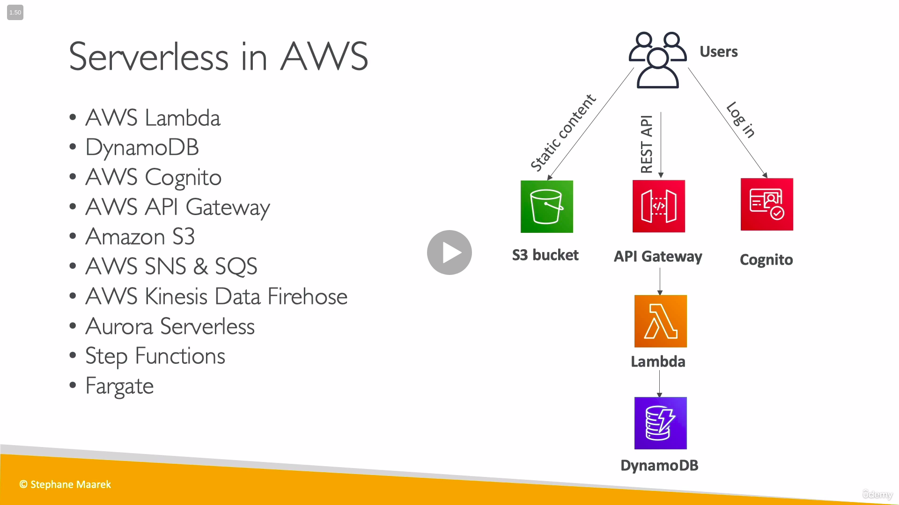

# AWS
Savings PLans available for Lambda, Fargate, and EC2
Horizontal Scaling  = adding several smaller instances when workloads increase 
Can work with AWS through AWS Management Console, CLI, or SDK

Server-based services include: Amazon EC2, Amazon RDS, Amazon Redshift and Amazon EMR.
Serverless services include: AWS Lambda, AWS Fargate, Amazon SNS, Amazon SQS and Amazon DynamoDB.
* Global Services include:
    * IAM(Identity and Access Management)
    * Route 53 DNS service
    * Cloudfront CDN 
    * WAF Web application firewall

* AWS CloudFormation - is a Yaml based tool used to define resources, infastructure as code. Uploads templates into S3
    * [AWS Resorces, all 224](https://docs.aws.amazon.com/AWSCloudFormation/latest/UserGuide/aws-template-resource-type-ref.html) represent different AWS components
    * Parameters - provide inputs for templates
        * Ref, YAML shorthand !Ref can call Parameters and Resources
        * Fn::GetAtt
    * Mappings - hardcoded values, handy for dev vs prod or AWS regions etc
        * Fn::FindInMap
    * Outputs - optional values that can be imported into other stacks.example outputting variables like VPC ID or Subnet ID.
        * Need to be exported and imported using Fn::ImportValue
    * Conditions
        * Fn::If / Fn::Not / Fn::Equals etc
    * Other Functions
        * Fn::Join
        * Fn::Sub
    * Rollbacks - if failure the changes get deleted and version rolls back to before failure
    * ChangeSets - view changes in stack before it happens
    * Nested Stacks - reuse stacks in other stacks example load balancer 
    * Cross Stacks - helpful when stacks have different lifecycles, use Export and Import
    * StackSets - Create, Update, Delete stacks across multiple accounts and regions
    

AWS Well Architected Framework, best practices for designing in cloud
1. Operational Excellence - run and monitor systems to deliver business value, automate changes and manage daily operations.
2. Security - protect information
3. Reliability - ability to recover from disruptions.
4. Performance efficiency - use computing resources efficiently
5. Cost Optimization service

* Infastructure as a Service - building blocks of cloud
* Platform as a Service - removes the need to manage infastructure like hardware and OS. 
* Software as a Service - completed product that is run and managed 

## Table of contents

* [AWS](#aws)
* [Services](#services)
* [EC2](#ec2)
    * [Instance Types](#instance-types)
        * [Serverless Computing](#serverless-computing)
    * [Pricing](#pricing)
    * [Scaling](#scaling)
* [Elastic BeanStalk](#elastic-beanstalk)
* [SNS + SQS + Kinesis](#SNS-SQS-and-Kinesis)
* [Global Infastructure](#global-infastructure)
* [Networking](#networking) 
    * [Network ACL](#network-acl)
    * [DNS](#dns)
* [Storage and DB](#storage-and-db)
    * [EBS](#ebs)
    * [S3](#s3)
    * [EFS](#efs)
    * [Databases](#databases)
* [Security](#security)
    * [Monitoring](#monitoring)
* [Support](#support)
* [Migration](#migration)

## Services
Most services are region scoped

* AWS Amplify - fully managed service for hosting static web apps. CI/CD 
* AWS CloudHSM - security model that lets you use your own encryption keys
* AWS CodePipeline - Full CI build for AWS, Codestar is a wrapper that groups everything into one
    * AWS CodeCommit - used for software version control by developers. github clone
        * Use AWS STS with AssumeRole API to share cross accounts, SSH Keys, or HTTPS credentials in user profiles. Doesnt support HTTP public access 
    * AWS CodeBuild - continuous integration service allows testing code, jenkins clone
        * builds docker images, uses buidspec.yml(placed at root folder) for instructions
        * by default can't access resources in VPC, CodeBuild is launched outside of VPC
    * AWS CodeDeploy - automates code deployment to instances.
        * Order is Stop Application => Before Install => After Install => Start Application
* AWS Config - continually audit, monitor for compliance, or vulnerabilities in AWS.Helps with compliance auditing, security analysis, change management, and troubleshooting. 
* Amazon Detective - easily investigate security findings.
* AWS Glue - data transformation tool that Extracts, Transforms, and Load service 
* Amazon GuardDuty - threat detection that monitors accounts and workloads
* Amazon Macie - data security and data privacy service that uses machine learning to protect data 
* AWS Professional Services - team of experts that help set up desired business on AWS
* Amazon Quicksight - Business Intelligence tool
* AWS Service Limits or Service Quotas - can use AWS Trusted Advisors Service Limit dashboard to monitor. Can be increased by contacting Amazon. Applied to AWS account level
* Server Name Indication(SNI) - used to route multiple SSL certificates

## EC2
Elastic Cloud Computation
Infrastructure as a Service - computers and data storage provided
EC2 Metadata - Only accesible from inside AWS. URL: http://169.254.169.254/latest/meta-data

### Instance Types
* General Purpose - Balanced
* Compute Optimized - for processing heavy loads
* Memory Optimized - for something like a high performance database
* Accelerated Computing - graphics or streaming
* Storage Optimized - Data warehousing or high read and write performance

#### Serverless Computing

* AWS lambda - Cloud function that only gets charged when triggered 
* ECS (Elastic Container Service) - 
    * Task Definition - json metadata to tell ECS how to run a docker container.
    * Task Role - allow each tasks to have a specific role, use different roles for different services.
        * Task Placement - When service is scaled in ECS the task placement figures out what container to put it in
            * Binpack - places task on instance with least available  cpu/memory. cost savings
            * Random 
            * Spread - Evenly spread task
* EKS (Elastic Kubernetes Service) - 
* Fargate - Works with both ECS and EKS, its a container engine

### Pricing
* On Demand - always available 
* EC2 Savings Plan - Ideal for workloads that require consistent compute usage 1 year or 3 year terms. 72% savings
* Reserved Instance - Billing discount applied to On Demand instance with 1 year or 3 year renewal
    * Standard RI - Most significant discount 72%
    * Convertible RI - change attributes as long as its an even exchange discount 54%
* Spot Instance - Ideal for flexible workloads or one that can withstand interruptions. 90% savings
* Dedicated Host - Fully dedicated to one host

* AWS Resource Groups - Use to create custom console for environments and view/manage resources easily.

* AWS Cost & Usage report - contains the most conprehensive set of AWS cost and usage data
* AWS Cost Explorer - visualize and understand and manage AWS cost and usage, forecast up to 12 months ahead.  

### Scaling
* EC2 Auto Scaling - Auto optimizes servers and instances to meet needs, can set min, desired, and max. Cannot span multiple Regions.
* Elastic Load Balancing (ELB) - Balances traffic coming in, not global service. Distributes traffic across multiple Availability Zones within the same AWS Region.
    * 3 types of balancers (Stickiness in load balancing uses cookies to keep client connecting to the same server)
        * Classic Load Balancer - HTTP, HTTPS, TCP
            * Provides a static DNS name we can use in our application.
        * Application Load Balancer (ALB) - HTTP, HTTPS, Websocket. 
            * Can route based on URL, hostname, Query String and fits well with docker.
            * Comes with Cross-Zone Load Balancing on by default with no charges for inter AZ data
            * Target groups can be Ec2 instances, Ip Addresses, or Lambda Functions
            * Provides a static DNS name we can use in our application.
            * need to use the X-Forwarded-For header to get originating IP address of traffic.
        * Network Load Balancer - TCP, TLS, UDP. Low Latency and high performance
            * exposes a public static IP
    * Scaling Policy Types (after scaling there is a default cooldown of 300 seconds before another scaling option can happen.)
        * Target Tracking scaling - Increase or decrease based on target value such as 60% cpu usage
        * Step Scaling - Increase or decrease based on scaling adjustments that vary by alarm breach
        * Simple Scaling - Increase or decrease based on a single scaling adjustment
        * Scheduled Actions - Schedule adjustments based on patterns and time

* Amazon Machine Image (AMI) - provides info to launch an instance from a previous image or template

* CloudEndure Disaster Recovery - minimizes downtime and data loss, continually replicates machines

## Elastic BeanStalk
* Elastic Beanstalk - automatically handles the deployment details of capacity provisioning, load balancing, auto-scaling. Can also perform health checks on Amazon EC2 instances. Platform as a Service
    * Deployment Options
        * All at Once - fastest but has downtime
        * Rolling - updates a bucket at a time then moves to next
        * Rolling with additional batches - like rolling but spins up new instances to move the batch
        * Immutable - spins new instances in ASG, deploys to these and then swaps instances
        * Traffic Splitting / Canary Testing - Only small % of traffic sent to new version to test for failures
        * Blue Green - manual swap of URL's
    * Beanstalk Extensions - zip file with .ebextensions/ directory and extensions ending in .config

## SNS SQS and Kinesis
* SNS - Simple Notification Service, publish messages to subscribers
    * Topic Publish - create a topic and a subscription
        * FIFO - one message delivery thru SQS. First in/First Out
        * Standard - Best effort to keep message order, at least once delivery. publish to SQS, Lambda, HTTP, SMS, Email
    * Direct Publish - for mobile create a platform and endpoint

* SQS -Simple Que Service, send store and receive messages. used to decouple applications. Default retention 4 days, max 14 days. up to 10 messages at a time. at least once delivery. First In => First Out 300 msg/s without batching, 3000 msg/s with. Group data by using Group ID. Scales automatically.
    * Message Visibility Timeout - message visibility timeout is 30 seconds by default, if not processed within the timeout it will be processed twice.
    * Dead Letter Queue(DLQ) - set a threshold of how many times the message can go back into the queue. After the threshold the message goes into the DLQ(Dead Letter Queue)
    * Delay Queue - default is 0 seconds but can be up to 15 minutes
    * Long Polling - Pull requests to SQS Queue, decreases API calls and increases efficiency. Between 1 - 20 seconds. 

* Kinesis - collect, process, and analyze streaming data such as Application logs, Metrics, and telemetry data. Meant for real time big data. Group data into shards using a partition key.
    * Kinesis Data Streams - scaled with shards. Retention between 1 day(default) to 365. Manage scaling thru shard splitting or shard merging.
        * producers - gets info from producers/source, puts it into shards. Provisioned Throughput Exceeded when shard is over used, need to use highly destributed partition key, retries with exponential backoff, or increase shards.
        * consumers - gets data streams and processes it in kinesis data firehose, kinesis data analytics, apps, or lambda 
            * shared (classic) Fan out consumer pull - max 5 get records api calls/sec
            * enhanced fan out consumer push - higher cost and lower latency pushes data to shards instead of pulling. 
    * Kinsesis Data Firehouse - upload streaming data into resources, automatic scaling. no data storage. convert data along the way
        * writes data to S3, Redshift, ElasticSearch, or custom API or 3rd party like MongoDB
    * Kinesis Data Analytics - SQL application
    * Kinesis Video Streams - 

## Lambda
* Pay per request and compute time, increasing RAM will also improve CPU and Network.
    * from 128mb - 10gb (64mb increments), at 1792mb you get more than one CPU and need to use multi-threading
    * Execution time ranging from 1 sec - 15 minutes
    * /tmp directory max size is 512mb, disk space for lambda that is discarded when function stops running. Environment variables size max is 4kb. 
    * up to 1000 concurrent executions, can be throttled with reserved concurrency
    * Dependencies - code and dependencies get zipped together and uploaded to Lambda if less than 50mb, else S3 first.
    * Versioning - is code + configuration that cant be changed. Versions get their own ARN(Amazon Resource Name) and cant be Changed
        * Aliases - point to different lambda function versions like "dev", "test". Aliases can't reference other aliases. Can be wieghted to distribute and test features between versions
        * Lambda and CodeDeploy - can automate traffic shift for lambda aliases either rolling or all at once.
* Application Load Balancer multi-header values - the load balancer supports values thru query strings in the http address that get turned into json arrays. Application Load Balancers are integrated with lambda with a target group.
* lambda @ edge - for deployment alongside CDN using CloudFront, can use lambda to change requests and responses from CloudFront
* Invoking functions
    * Synchronous Invocation - result is returned right away
        * Services:
    * Asynchronous Invocation - events are placed in an Event Queue
        * Services: S3, SNS, CloudWatch Events, CodeCommit/CodePipeline
        * Lambda Destinations - can send results to destinations like SQS for succesful and failed events. Recommend to use destinations over DLQ 
    * Event Source Mapping Invocation - reads from an event source that invokes a lambda function
        * Streamed Services: DynamoDB, Kinesis. by default if function returns error the entire batch is reprocessed until succeed or expire
        * Polled Services: SQS, MQ. 
* Logging and Monitoring
    * Cloudwatch Events - either cronjob or codepipeline into Cloudwatch Events/EventBridge. Lambda metrics are displayed in Cloudwatch Metrics.
    * X-Ray - enable in lambda configuration and use SDK in code.
        * Environment variables
            * _X_AMZN_TRACE_ID: contains the tracing header
            * AWS_XRAY_CONTEXT_MISSING: by default, Log_Error
            * AWS_XRAY_DAEMON_ADDRESS: the x ray daemon IP port
* Networking
    * By default the Lambda function is launched in its own VPC and can't access resources or internet unless defined, 
        * ENI(Elastic Network Interface) allows it to interact with VPC
        * Deploying lambda function in a private subnet with NAT Gateway/Instance gives it internet access. Can also use VPC endpoints to privately access AWS Services without a NAT

## Global Infastracture
Regions are geographically isolated areas and are made up of smaller availability zones/ data centers,  
Regions are picked based on the following:
* Compliance or regulations 
* Proximity 
* Available Services - some services may not be availaable in your region yet
* Pricing - varies by region due to operating costs

Edge Locations
Amazon Cloudfront is a Content Delivery Network that caches content closer to customers. An Edge Location is a site that is used for CDN.

## Networking
Public and private subnets in a VPC can communicate with each other
* VPC - Virtual Private Cloud is a regional resource, can organize resources into subnets which are availability zone resources
    * Internet Gateway - attach an internet gateway to a vpc to connect to the internet
    * NAT Gateway - AWS managed allow your instances in private subnets to access the internet
    * Transit Gateway - simplifies how customers connect all of their VPC's, acts as a hub
    * VPC Endpoints, only used within your VPC. Just to access AWS services privately within your VPC
        * VPC Endpoints Gateway - only for S3 and DynamoDB allow you to connect to AWS using a private network instead of wwww
        * VPC Endpoint Interface(ENI) - the rest of the services
    * VPC Peering - connects two VPC privately with AWS network, must be established in each VPC
* VPG - Virtual Private Gateway / VPN 
    * AWS Client VPN 
    * AWS site-to-site VPN - uses IPSec to establish connection between on premise and AWS. Over internet
    * AWS Direct Connect establishes a direct connection between your data center and a VPC. It is a private connection and doesn't use internet. 
    * AWS Outposts - provides AWS infastracture to on premises facility. 

### Network ACL
* Network Access Control List - subnet level firewall that checks packet coming or leaving a subnet. stateless(always checks)
* Security Group - Statefull and set at instances and can group instances. by default denies all inbound and allows all outbound. Used to control which Ip address can connect

### DNS
* Route 53 - Manages Dns records and offer health checks to monitor health and performance.
    * Most common record routings are:
        * A: hostname ipv4 example.com -> 12.3.1.3
        * AAAA: hostname ipv6
        * Cname: hostname to hostname test.example.com -> (only for non root domain)
        * Alias: hostname to AWS resource, free and works for root domain
    * Time to Live
        * High TTL(24hrs) has less traffic and possibly outdated records
        * Low TTL(60hrs) more traffic on DNS and records are outdated for less time.
    * Routing Policy
        * simple -
        * weighted - distributed based on percentage loads
        * latency - redirect to server with least latency
        * failover - health check mandatory
        * geolocation - routing based on user location, needs a default policy in case no match.
        * geoproximity - if you want to shift traffic from one region to another by increasing the bias
        * multi-value - route traffic to multiple resources and associate health checks with records. not a substitute for Load Balancing but helps.
    * Health Checks - checks status of resources, can integrate with CloudWatch
* Cloudfront - Can integrate AWS Shield and AWS WAF to protect against network DDOS attacks.

## Storage and DB 
EBS => multiple servers in same availability zone. 
EFS => multiple availability zones
S3 => multiple availability zones

Snapshots - incremental backups  
Lifecycle policies move data around to different storage classes based on time  

### EBS
* Elastic Block Store (EBS) - behave like physical hard drives. up to 16TiB, stores blocks which is better for example editing video where only some blocks change. Attach to EC2 and are a Zone level resource. Used for storing Amazon RDS databases. More expensive than S3. Cannot be attached to multiple compute resources at a time.
    * GP2/GP3: General Purpose SSD
    * IO1/IO2: High performance SSD for low latency and high throughput. Need more than 16,000 IOPS
    * ST1: Low Cost HDD designed for frequently accessed. Data Warehouse
    * SC1: Low cost HDD less frequently accessed workloads

### S3
Objects = files and buckets = directories

* Amazon Athena - Analytics service that makes it easy to query data in Amazon S3 using standard SQL commands.

* Amazon Simple Storage (S3) - store data as objects and stores them into buckets (max object size 5tb). Write once read many storage. Can host a static website or can be used as a media store for Cloudfront. Amazon S3 assigns a URL for each object you upload. Can scale and replicate data automatically across multiple Availability Zones(except One-Zone IA). Cant be attached to compute resources
    * Types
        * S3 Standard - Can also store static website hosting in S3
        * S3 Standard Infrequent Access - long term storage but needs quick access, lower storage price and higher retrieval price
        * S3 OneZone IA - Stores data in a single zone, lower storage price
        * S3 Intelligent Tiering - Ideal for data with unknown or changing access patterns
        * S3 Glacier - Long term storage for data archiving, minimum storage duration 90 days, retrieve within hours
            * Expedited Retrieve - 1-5 mins
            * Standard - 3-5 hours
            * Bulk - 5-12 hours
        * S3 Glacier Deep Archive - lowest cost storage, minimum storage duration 180 days, retrieve within several hours
            * Standard - 12 hours
            * Bulk - 48 hours
    * S3 Encryption
        * SSE-S3 - server side encrypts S3 objects using keys managed by AWS
            * Must set header "x-amz-server-side-encryption":"AES256"
        * SSE-KMS - Key Management Service, server side encryption
            * Must set header "x-amz-server-side-encryption":"aws:kms"
        * SSE-C - Manage your own encryption, server side encryption
            * Https must be used
            * Encryption key must be provided in HTTP headers
        * Client Side Encryption - Client handles encrypt/decrypt and manages keys
    * S3 Security, (can connect to s3 using VPC Endpoints and logged in AWS Cloudtrail)
        * User Based - IAM Policies sets what Users are allowed to do what API calls 
        * Resource Based  
            * Bucket wide rules from the S3 console
            * Object Access Control List (ACL) - finer grain control
            * Bucket Access Control List (ACL) - less common
    * S3 Replication( buckets can be in different accounts)
        * CRR(Cross Region Replication) - compliance reasons, lower latency, across accounts
        * SRR(Same Region Replication) - log aggregation, live replication between production and test accounts
    * S3 Lifecycle Rules can be created for path prefix or certain object tags
        * transition actions - when objects are moved to another storage class
        * expiration actions - objects are deleted after some time
    * S3 Performance
        * Multi Part Upload - auto applied for files 5gb or larger. speeds up transfers by splitting up file 
        * S3 Transfer Acceleration - Increase transfer speed by using AWS Edge locations
        * S3 Byte-Range - Can be used to speed up downloads by running parallel, can also be used to retrieve partial data
        * S3 Select and Glacier Select - use SQL statements to filter data
### EFS
* Amazon Elastic File System (EFS) - multiple instances reading and writing simultaneously, linux file system, regional resource and auto scaling. More expensive than EBS. use Security groups to control access.
    * Bursting Vs Provisioned: Bursting throughput grows with filesystem but with provisioned throughput is set to a high throughput regardless of file size 
    * Lifecycle Management: move file after N days into either standard or EFS-IA(Infrequent Access)

### Databases
* Amazon RDS (Relational Database Service) - SQL to store and query data, managed service that automates scaling, backups, and setup. Stored on EBS
    * Read Replicas - up to 5 Read Replicas, ASYNC so reads are eventually caught up. Cant write to replica. IF AWS in same region you do not pay for data transfers
    * RDS Multi AZ(Disaster Recovery) failover in case of loss
    * Encryption - encrypt with AWS KMS. If master is not encrypted the read replicas can't be encrypted. SSL Certificate to encrypt data in flight,needs to be turned on.
    * Security - uses security groups to control which IP can communicate. Can also use Policies, username and password or IAM-token authentication(only in Mysql and Postgresql and only last 15 mins)
* Amazon Aurora - Mysql and PostgreSQL relational database, an Amazon RDS service. 5x performance. Offers high availability, read scaling, and auto scaling
    * Can have up to 15 read replicas and a Master
    * Has writer endpoint for master and reader endpoint for load balancing replicas
* Amazon ElastiCache - managed Redis or Memcached service. In memory DB that makes app stateless. 
    * REDIS - has Read Replicas and data durability, backup and restore features.
    * MEMCACHED - Multi-node for sharding, no backup and restore or replication. For data that can be lost.
    * Cache Strategies
        * Lazy-Loading - Only requested data is cached. If data not in cache it has to read cache, read db, and then write to cache resulting in higher read latency. Data can also be stale as it isnt updated right away.
        * Write Through - Data in cache is never stale but gets a write penalty instaed of read penalty. Data is written to cache then written to db
    * Replication Cluster
        * No cluster - One primary node up to 5 replicas. 1 write and several reader nodes. One shard all nodes have all the data.
        * Cluster Mode - data is partitioned across shards
* Amazon DynamoDB - non relational database using key-value pairs. Replication across 3 AZ.
    * Maximum size of an item is 400kb, can store large objects in S3 and send metadata to DynamoDB
    * Primary Keys
        * Partition Key only (hash) - must be unique for each item ex: user id
        * Partition key + sort key - data is grouped by partition key, sort key is range key ex: user id = partition key and game id = sort key
    * Indexes
        * Local Secondary Index (LSI) - must be defined at creation, alternate range key for table that is local to hash key. up to 5 indexes per table 
        * Global Secondary Index (GSI) - speed up queries on non-key attributes, can be modified unlike LSI. If writes are throttled on GSI then main table will be throttled.
    * Throughput, can be increased temporarily using burst credit and spread throughout partitions
        * read capacity units - throughput for reads. 
            * Eventuall Consistent Reads - By default. 2 reads per second for up to 4kb in size
            * Strongly Consistent Reads - 1 read per second for up to 4kb in size
        * write capacity units - 1 write capacity represents 1 write per second of 1kb in size
        * throttling - if we exceeed use we get ProvisionedThroughputExceededException, can be fixed with exponential back off or using DynamoDB Accelerator(DAX)
    * API
        * write
            * PutItem 
            * UpdateItem
            * Conditional Writes - accepts a write only if conditions are met
        * delete
            * DeleteItem - can also be a conditional delete
            * DeleteTable 
        * read
            * GetItem - read based on primary key
        * batching - reduces # of API calls
            * BatchWriteItem - up to 25 in one call, up to 16mb of data written, up to 400kb of data per item. If batched items fail we need to use exponential back-off algorithm
            * BatchGetItem - up to 100 items, up to 16mb of data
        * query - returns items based on filter or value. up to 1mb of data 
        * scan - scans the entire table and filters out data(inefficient)
    * DAX - DynamoDB Accelerator, low latency cache with 5 minutes TTL for cache by default
    * Streams - changes in DynamoDB can be turned into a stream and read by Lambda and EC2 instances. Made of shards like Kinesis Data Streams
        * Lambda - uses event source mapping with permissions. Invoked synchonously 
    * CLI
        * --projection-expression - attributes to retrieve
        * --filter-expression - filter results
        * --page-size - full dataset received but each API call will request less data
        * --max-items - max # of results
        * --starting-token - dictates where to start
    * Transactions - CRUD operations for multiple rowa in different tables. if one update fails they all fail
        * capacity - consumes 2x WCU RCU
* Amazon Redshift - Fully Managed data warehousing services for big data analytics. Server Based
* Amazon Storage Gateway - helps extend their on-premise storage to AWS
* Amazon Elastic Map Reduce (EMR) - fast and efficient processing of big data using Hadoop framework  

## Security
Security Bulletins - AWS notifies customers about security and privacy events.

Follow best practice of giving least privilages 
* AWS IAM - Identity and Access Management, by default all actions denied. Have to grant privelages as the root user
    * Users - Recommended IAM entity when granting a person long term access permissions.
    * Groups - Collection of Users and permissions, can't contain other groups or nest. Users can belong to more than 1 group 
    * Policies - allows or denies permissions to AWS, attached to users
        * Policy Generator Site - https://awspolicygen.s3.cn-north-1.amazonaws.com.cn/policygen.html
        * Policy Simulator - google it
    * Roles - Access to temporary time and permissions, given to users, apps, etc best for short term. Does not have standard long-term credentials instead temp credentials.
* AWS Organizations - For large business
    * Service Control Policy (SCP) - To centrally control policies, Can do policies in Organizational Units and individual members.
* AWS Artifcat - Security and Compliance reports
* AWS Shield - DDOS protection service
* AWS Key Management Service (KMS) FF- to create and control encryption keys used to encrypt data such as EBS volumes
* AWS Web Application Firewall (WAF) - used to monitor HTTP and HTTPS requests that are forwarded to Amazon CloudFront or Load Balancer
* AWS Inspector - Automated security assessment service that helps improve the security and compliance

* Amazon Cognito - let's customers add user sign in with Facebook, Google, Amazon
* Amazon Cloud Directory - directory service provides web-based directories to organize users, groups, devices, policies
* Amazon Directory Service - provides single sign on to AWS, uses existing Microsoft Actice Directory

### Monitoring
* Cloudwatch - Focuses on the activity of AWS services and resources, reporting on their health and performance. Security repositry with threat analytics and metrics. 
    * Metrics - 
        * Basic Monitoring - metrics every 5 mins
        * Detailed Monitoring - metrics every 1 min
        * High Resolution - metrics every 1 second, alarm can be triggered as often as 10 seconds
    * Logs - Can go to S3 for archival, stream to ElasticSearch. By default no longs from EC2 will go to CloudWatch. Can be setup on premise also. Never expire by default
        * Cloudwatch Logs Agent - old version of agent, can only send CloudWatch logs
        * CloudWatch Unified Agent - Can collect additional metrics like ram etc. 
    * Events - send notifications can schedule on a CRON or event pattern.
        * EventBridge - evolution of Cloudwatch events, can work with Zendesk, DataDog, Etc
    * Alarm - triggers notifications for any metric
* Cloudtrail - Log of all actions and API calls taking place in AWS
* X-Ray - troubleshooting application performance and errors, must import the AWS X-Ray SDK and install X-Ray daemon to enable it
    * Tracing - end to end way to follow requests
        * Segments/SubSegments - details on app/service
        * Sampling - amount of requests sent
        * Annotations - Key-Value pairs used to index traces and use with filters
        * Metadata - Key-Value pairs, not indexed or used for searching 
    * If not working in:
        * EC2 ensure IAM role has proper permissions and daemon running
        * AWS Lambda ensure IAM role has IAM execution role and X-ray is imported into code

## Support
* AWS Support plans
    * Basic - 
    * Developer - 
        * Best practice guidance, 
        * Client Side Diagnostics
        * Architecture/tecgnical support during business hours.
    * Business - response time of 1 hour for production systems
        * Use case guidance, 
        * All aws trusted advisor checks
        * AWS Personal Health dashboard 
        * 24x7 technical support engineers. 
        * AWS Support API
        * Access to Infastructure Event Management(IEM) for a fee, included with Enterrpise
        * Chat access to AWS Support Engineers
    * Enterprise - Response time of 15 mins for production systems
        * Application architecture guidance, event management, 
        * Technical Account Manager (TAM) and Support Concierge Service (AWS Billing and account experts) 
        * AWS support API 
        * Access to Infastructure Event Management(IEM) - provide architectural and scaling guidance

* AWS Well Architected Framework - Evaluates workload agaisnt the 5 pillars
    * Operational Excellence -  The ability to run and monitor systems and improve supporting processes and procedures. Example: Cloudformation to manage servers as code. 
    * Security - Delivering business value through trisk assesssments and mitigation
    * Reliability - Recover from interruptions and change resources to meet demand
    * Performance Efficiency - Selecting right resources based on workload requirements and making informed decisions to maintain efficiency
    * Cost Optimization - Reduce cost of ownership, avoid or eliminate unneeded cost.

## Migration 
* AWS Total Cost Ownership (TCO) - free tool that provides info on possible savings when deploying to AWS. (Cost Explorer only analyzes current cost and ussage)
* AWS Application Discovery Service - helps systems integrators plan application migration projects by identifying on-premise applications.
* AWS Cloud Adoption Framework (CAF) - helps organizations design a road map to cloud adoption

* AWS Cloud Migration Framework
    * Business 
    * People - HR
    * Governance
    * Platform
    * Security
    * Operations
* 6 Different Staretegies for Migration
    * Rehosting - Lift and Shift 
    * Replatforming - Lift, Tinker, and Shift
    * Refactoring - Driven by a need to add new features and edit code
    * Repurchasing - Software as a service option
    * Retaining - Keeping critical applications at the source environment
    * Retiring - removing applications that are no longer needed
* Snow Family - transports data into aws physically
    * snowcone - 8tb
    * snowball - 42tb to 80tb 
    * snowmobile - 100PB

* CloudEndure Migration - automated lift and shift for migrating apps.

* AWS Server Migration Service(SMS) - migrates workloads to AWS, supports virtual machine migrations, then saves them as a new Amazon Machine Image(AMI) that can be launched as an EC2
