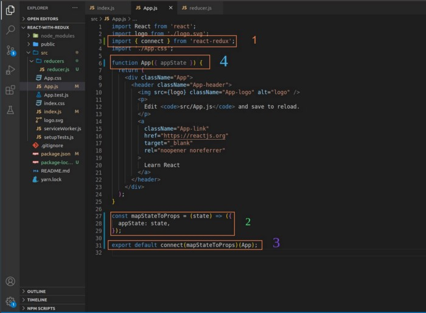
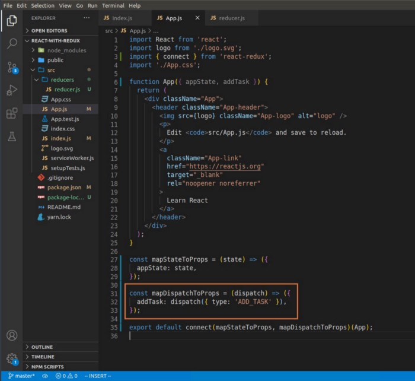

# React Notes

Notes on learning React.

[Headless UI](https://headlessui.dev/) Prebuilt Component for react. [React Spring](https://docs.pmnd.rs/react-spring/introduction)

Build tools for Development Webpack(bundler), Babel(supporting older browsers), Terser(minify files)

[React Docs Getting Started](https://reactjs.org/docs/hello-world.html)
[15 React Libraries](https://dev.to/coursesity/react-libraries-to-use-in-2021-15-top-picks-37d7) to use
Docker a react app[mherman blog](https://mherman.org/blog/dockerizing-a-react-app/)
[React Best Practices](https://betterprogramming.pub/21-best-practices-for-a-clean-react-project-df788a682fb)
[Change Class Components to Function Components in React ](https://nimblewebdeveloper.com/blog/convert-react-class-to-function-component)
<br><br>

---

## Table of Contents

-   [React Notes](#react-notes)
    -   [Class](#class)
        -   [Class Lifecycle Methods](#class-lifecycle-methods)
        -   [Async and Await](#async-await)
    -   [Functions](#functions)
        -   [hooks](#hooks)
            -   [useState](#usestate)
            -   [useEffect](#useeffect)
            -   [useFetch](#usefetch)
    -   [API](#api)
    -   [Switch vs Router](#switch-vs-router)
    -   [Hashrouter vs Browserrouter](#hashrouter-vs-browserrouter)
    -   [Navlink vs Link](#navlink-vs-link)
    -   [Styling](#styling)
        -   [Inline Styling React](#inline-styling-react)
    -   [Redux](#redux)
    -   [Tutorials](#tutorials)
        -   [Navbar](#navbar)
        -   [Flashcard](#flashcard)
        -   [Reactstrap](#reactstrap)
-   [Next](#next)

---

## Class

An example of using classes, inheritance, and state on [medium](https://medium.com/swlh/create-a-web-page-using-react-d5ad9d03fb1f)
<br><br>

### Class Lifecycle Methods

Lifecycle methods docs [react](https://reactjs.org/docs/react-component.html#commonly-used-lifecycle-methods)

-   constructor()
    -   used for initializing local state by assigning an object to this.state.
    -   used for binding an event handler method to an isntance
    ```
        constructor(props) {
        super(props);
        // Don't call this.setState() here!
        this.state = { counter: 0 };
        this.handleClick = this.handleClick.bind(this);
        }
    ```
-   getDerivedStateFromProps()
    -   invoked right before calling the render method, used for when state depends on changes in props over time
-   render()
    -   the only method required in a class component
-   componentDidMount()
    <br><br>

### Async Await

A synthatic sugar over Javascript Promises, helpful when fetching from an API. You can use try/catch for proper error handling [valntinog blog](https://www.valentinog.com/blog/await-react/)
<br><br>

---

## Functions

Building a clock component using classes then refractoring to functions [dev.to](https://dev.to/danielleye/react-class-component-vs-function-component-with-hooks-13dg) able to use Hooks.
<br><br>

### Hooks

[Fireship YT](https://www.youtube.com/watch?v=TNhaISOUy6Q) Hook tutorials and building your own Hook from scratch.
<br><br>

-   useState
-   useEffect
-   useContext - remove prop drilling
-   useReducer - Redux pattern, dispatch actions => reducer => store
-   useRef - common use case of this is to grab html elements from DOM. Like useState but doesnt trigger a re-render
-   useMemo - used when needed to make expensive calculations, improve performance
-   useCallback -

#### UseState

Instead of setting state with this.state in a constructor we can import useState.

[Web Dev Simplified YT](https://www.youtube.com/watch?v=O6P86uwfdR0)

```
const [count, setCount] = useState("")
```

<br><br>

#### UseEffect

We can pass in a function in useEffect to update on change. Also allows to pass in an array as the second argument.

[Web Dev Simplified YT](https://www.youtube.com/watch?v=0ZJgIjIuY7U&t=309s)

useEffect replacing componentDidMount [stackoverflow](https://stackoverflow.com/questions/53945763/componentdidmount-equivalent-on-a-react-function-hooks-component)

[Webdev blog](https://thewebdev.info/2020/05/05/react-hooks-equivalent-of-componentdidmount/) on using useEffect
<br>

#### UseReducer

React hook similar to REDUX

```
function reducer(state,dispatch){
    switch(action.type){
        case 'increment':
            return state + 1
        case 'decrement':
            return state -1
        default:
            throw new Error()
    }
}

function useReducer(){
    const [state,dispatch] = useReducer(reducer, 0)
}

```

#### UseFetch

[Medium](https://medium.com/swlh/write-a-custom-reusable-hook-usefetch-1443d8d4e1e1) useFetch to write a custom reusable hook
<br><br>

---

## API

Can test api with api placeholders [jsonplaceholder](https://jsonplaceholder.typicode.com/users)

---

## Switch vs Router

[Router vs Switch explained](https://medium.com/@jenniferdobak/react-router-vs-switch-components-2af3a9fc72e)
[Router and Switch example](https://reactrouter.com/web/api/Switch)
A switch is helpfull with **nested routes**, will only render the first matched.<br><br>

## Hashrouter vs Browserrouter

**Hash Router**: for small applications that dont need backend. Has # in url
**Browser Router**: recommended when we have backend or static web page host <br><br>

## Navlink vs Link

Example of React Navlink and Route. Navlink is used to specify which element is active in a Navigation Bar with CSS

```
<li><NavLink to="/about">About</NavLink></li>
<Route path="/about" component={About}/>

<!-- CSS -->
.active {
  background-color: #0099FF;
}
```


### Protected routes
Using React-Router-Dom [StackOverflow](https://stackoverflow.com/questions/62384395/protected-route-with-react-router-v6) and [StackOverflow](https://stackoverflow.com/questions/69923420/how-to-use-private-route-in-react-router-domv6)

<br><br>

---

## Styling

### Inline Styling React

Styled components are inline and can be used to define styles and reusable components. [Styled-Components Site](https://styled-components.com/docs/basics) Getting Started styling components

[Styled-Components Site](https://styled-components.com/docs/faqs#can-i-nest-rules) Faqs show to Nest Rules, CSS Frameworks, Override Styles, Attrs
<br><br>

---

## Redux
[React hooks instead of redux](https://betterprogramming.pub/10-easy-steps-to-abandon-redux-for-the-remarkable-react-hooks-124916fc634d)


[Redux Getting started](https://redux.js.org/introduction/getting-started)
[Redux Essentials](https://redux.js.org/tutorials/essentials/part-1-overview-concepts)
[Redux Fundamentals](https://redux.js.org/tutorials/fundamentals/part-1-overview)
[Redux Toolkits](https://redux-toolkit.js.org/)

[Medium](https://medium.com/swlh/understanding-react-redux-and-react-redux-c52d46dd1a04) Understanding react Store -> View -> Actions -> Reduce -> Store

[Data flow tutorial, very helpful](https://redux.js.org/tutorials/essentials/part-3-data-flow)
Start template for Redux

```
npx create-react-app my-app --template redux
```

Redux setup steps (Global state should go in the Redux store, local state should stay in React components)

-   **Setup Redux store**, middleware and thunks, make sure to ```import store from “./store”  ``` in main react file
    -   `npm install redux redux-thunk` and `npm install --save-dev redux-devtools-extension`
    -   Import `{Provider} `, **Provider makes Redux store available to any component**  from react-redux and `createStore` from `redux `to reacts `index.js`


```
import {createStore, applyMiddleware} from "redux"
import {composeWithDevTools} from "redux-devtools-extension"
import thunk from "redux-thunk"
import rootReducer from "./reducers"

const middleware = [thunk]

const store = createStore(
    rootReducer,
    composeWithDevTools(applyMiddleware(...middleware))
)

export default store
```

-   Reducer located in either component/whatever or features/whatever is organized into a slice. Import CreateSlice and work reducer functions.
    -   async logic is done with a thunk
-   **Actions** are plain objects with a **type field**, and **describe "what happened" in the app**

```
function addTask(task){
    return {
        type: "ADD_TASK",
        task:task
    }
}
```

-   **Reducers** are functions that calculate a **new state** value based on previous **state + an action**, sent to store.
    -   A Redux store runs the root reducer whenever an action is dispatched, reducers should combine into one file or store`/reducers/index.js` can use `combineReducers ` from Redux

```
const initialState = {}
export defualt function taskReducer(store=initialState, action){
    const {type, payload} = action

    switch(type){
        case "ADD_TASK":
            return task: payload

        default:
            return state // or ...state
    }
}
```

-   Altering State using REDUX

    -   **mapStateToProps** or **mapDispatchToProps** - defines access to the store. [Images from Medium Guide](https://medium.com/swlh/how-to-use-redux-with-react-a-step-by-step-guide-1cca75c6397a)
        -   mapStateToProps - function takes the store/state and maps it to appState: state
        
        - mapDispatchToProps - function to handle store updates, takes dispatch and returns an object where a function is mapped to the state.
        

    -   **UseSelector** redux hook lets our component extract whatever pieces of data it needs from the Redux store state.
        -   Can also initiate state using UseSelector redux hook
        ```
        import { useSelector } from "react-redux";
        const countPlusTwo = useSelector(state => state.counter.value + 2)
        ```
    -   **UseDispatch** is a redux hook that gives access to the dispatch method from the store, typically used like below:

        ```
        import { useDispatch } from "react-redux";
        const dispatch = useDispatch();

        <button
        className={styles.button}
        aria-label="Decrement value"
        onClick={() => dispatch(decrement())}
        >
        ```

```
// Old way of doing this
import {createStore} from 'redux'

function counterReducer(state = {value:0}, action) {
    switch (action.type){
        case 'counter/incremented':
            return {value: state.value + 1}
        case 'counter/decremented':
            return {value: state.value - 1}
        default:
            return state
    }
}

// Can use subscribe, dispatch is the only way to update the state, getstate to retrieve the updated value
let store = createStore(counterReducer)
store.subscribe(() => console.log(store.getState()))

store.dispatch({type: 'counter/incremented'})
store.dispatch({type:'counter/incremented'})
store.dispatch({type: 'counter/decremented'})

console.log(store.getState())
```

---

## Tutorials

An extensive tutorial on building a react Todo List from scratch. [vegibit site](https://vegibit.com/create-a-react-element-from-scratch/)

[Brian Design YT](https://www.youtube.com/watch?v=3nLTB_E6XAM) building a React site 2hr tutorial. Have not gone through it

[Dev.to](https://dev.to/rafavls/creating-a-weather-app-with-reactjs-part-2-5gi3) Creating a weather app with React, Openweather API, Google Geocode API

### Navbar

[Fireship YT](https://www.youtube.com/watch?v=IF6k0uZuypA) Recreating Facebook Navbar using React, CSS, and HTML

[Brian Design YT](https://www.youtube.com/watch?v=CXa0f4-dWi4) creating a slide out navbar.
<br><br>

### Flashcard

[Web Dev Simplified YT](https://www.youtube.com/watch?v=hEtZ040fsD8&t=2096s) building a flashcard app, using an API for data.
<br><br>

### Reactstrap

A bootstrap for React
<br><br>

---

# Next

Start next application

```
npx create-next-app nextjs-blog --use-npm
npm run dev
```

## Basics

Make sure to edit [metadata](https://nextjs.org/learn/basics/assets-metadata-css/metadata) in head section and create a [layout](https://nextjs.org/learn/basics/assets-metadata-css/metadata)

### CSS styling

Global styles are imported into the pages/\_app.js, all other styles use css modules and must end with .module.css

### Img

Next has its own [Image tag](https://nextjs.org/docs/basic-features/image-optimization) will need to [configure host](https://nextjs.org/docs/messages/next-image-unconfigured-host) when setting it up.

### Static vs Server Rendering

[Next.js Pages](https://nextjs.org/docs/basic-features/pages) and (data fetching)[https://nextjs.org/docs/basic-features/data-fetching]

-   Static Rendering - The HTML is generated at build time and will be reused on each request.
    -   getStaticProps - page content depends on external data. Can Data Fetch so that we can pre render with data
    -   getStaticPaths - page path depends on external data
-   Server Rendering - The HTML is generated on each request. Best for data pages that need data that is rendered on each request.
    -   getServerSideProps - is run on every request, fetches the data and passes it to the page

### Router

-   index routes - The router will automatically route files named index to the root of the directory.
-   nested routes - nested folders and files in the pages will be generated in the same way
-   dynamic routes - use bracket syntax to match named parameters []

#### Link

Next has its own Link tag format

```
<Link href="/about">
    <a>About Us</a>
</Link>
```

#### useRouter

[useRouter hook](https://nextjs.org/docs/api-reference/next/router#userouter), can use router.push for buttons and for passing data into url. Also looks into router.prefetch that would for example prefetch a page after login.
