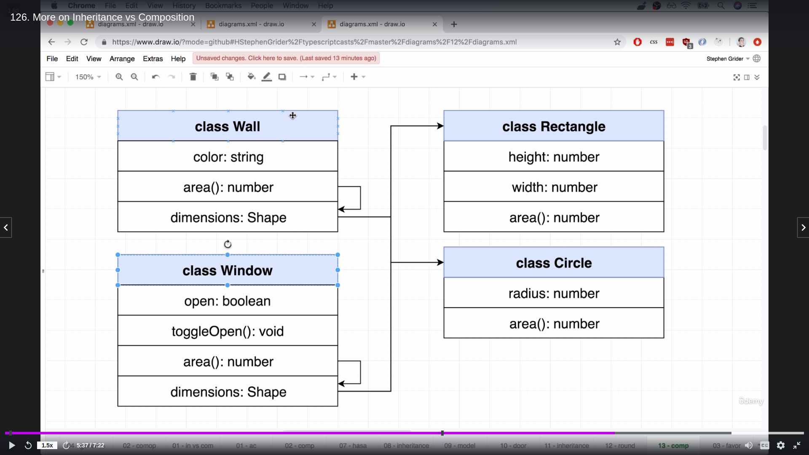
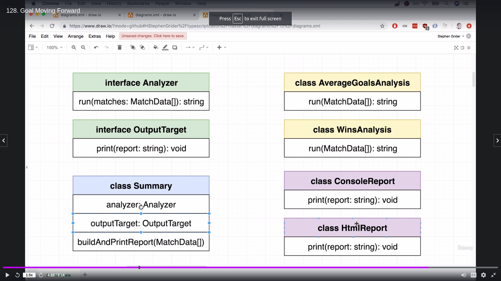

# Typescript

Can initialize a repo using `tsc --init` and can watch files using `tsc- -w`. Can also use `nodemon` and `concurrently` to automate refreshes

-   Types - used by compiler to analyze our code for errors.
    -   Primitive Types:
        -   any - avoids checking values
        -   string -
        -   number -
        -   boolean -
        -   Date -
        -   void - used to not return anything, null or undefined
        -   undefined - absent or uninitialized value
        -   null - absent or uninitialized value
        -   symbol - js primitive used to create a globally unique reference via the function Symbol()
        -   Element - basic class all objects in a Document inherit
    -   Object Types:
        -   functions -
        -   arrays - represent a collection of records with some sort order
        -   tuples - Typescript Data Structure, array like structure represents one record, fixed length with specified types. Can represent named objects with a tuple.
            1. Define the tuple as a new type
            2. Convert the row of strings into appropriate types.
        -   enum - adds values to a list
        -   classes -
        -   objects -
-   Type Annotations - We tell Typescript what type of value a variable will refer to
-   Type Inference - Typescript tries to figure out what type of value a variable refers to
-   Type Assertion - use angle brackets or `as` to change a type.
    -   Override typescripts default behavior
-   Type Guard / Narrowing - Used to restore access to a set of properties in a UNION. Can narrow type of value by checking either:

    -   `typeof` - Can narrow type using primitives only on `number`, `string`, `boolean`, or `symbol`
    -   `instanceof` - every other value that is created with a constructor function like an `Array`, `Date`, `Classname`
    -   Bad design pattern used as just an exmaple

```
class Sorter{
    constructor(public collection:number[] | string){}

    sort(): void{
        <!-- Can be refractored into const {length} = this.collection -->
        const length = this.collection.length;

        for(let i=0; i < length; i++){
            for (let j=0; j < length -i - 1; j++){
                <!-- Use Type Guard Check if collection is an Array -->
                if(this.collection is instanceof Array){
                    if(this.collection[j] > this.collection[j + 1]){
                        const tempLeft = this.collection[j]
                        this.collection[j] = this.collection[j + 1]
                        this.collection[j + 1] = tempLeft
                    }
                }

                if(typeof this.collection === "string"){
                    this.collection.match()
                }
            }
        }
    }
}

const sorter = new Sorter([10,2,-5,0])
sorter.sort()
console.log(sorter.collection)
```

## Table of Contents

-   [Basics](#basics)
    -   [Inheritance vs Composition](#inheritance-vs-composition)
-   [Commands](#commands)
-   [Syntax](#syntax)
    -   [Destructure](#destructure)

## Basics

-   Type Alias - types can be used with primitives and unions, a type can not be re-opened to add new properties

    ```
    type Style = string;
    let font: Style;
    ```

    -   Extending a type

```
type Animal = {
    name: string
}

type Bear = Animal & {
    honey: boolean
}

const bear = getBear()
bear.name
bear.honey

<!-- Gets an error when trying to change, says Dupplicate identifier -->
type Animal = {
    name: boolean
}
```

-   Interfaces - Creates a new type describing the property names and value types of an object. Can't be used with primitives and unions, best used with Objects.
    -   Use when we have very different objects that we want to work together
    -   Promotes loose coupling
    -   Can extend interfaces and add new fields to an existing interface

```
interface Vehicle {
    name: string;
    year:number;
    broken: boolean;
    [key: string]: any      //add any additional property
    summary(): string       //define a function named summary that returns a string.
}

interface SUV extends Vehicle{
    lifted: boolean;
}

<!-- Adding to an existing field -->
interface Vehicle {
    wheels: number;
}

const oldCivic = {
    name: 'civic',
    year: 1998,
    broken: true,
    summary():string {                          //define an ES5 function in the object
        return `Name: ${this.name}`;    
    } 
}

const printVehicle = (vehicle: Vehicle): void => {
    console.log(vehicle.year)
}

printVehicle(oldCivic)
```

-   Inheritance / Abstract Class - Try interfaces first unless different objects are closely related, Can use for classes when you need to inherit the class in another class instead of interfaces.
    -   Use when we are trying to build up a definition of an object
    -   Strongly couples classes together abstraact classes and child classes are fully dependant on each other and dont function without the other.

```
// sorter.ts file
interface Sortable{
    length: number;
    compare(leftIndex:number, rightIndex:number): boolean
    swap(leftIndex:number, rightIndex:number): void
}

export abstract class Sorter {
    abstract length: number
    abstract compare(leftIndex:number, rightIndex:number): boolean
    abstract swap(leftIndex:number, rightIndex:number): void

    sort():void{
        const {length} = this

        for(let i=0; i < length; i++){
            for(let j=0; j < length -1 -i; j++){
                if(this.compare(j, j+1)){
                    this.swap(j, j+1)
                }
            }
        }
    }
}


// NumbersCollection.ts
import {Sorter} from "./Sorter"

export class NumbersCollection extends Sorter{
    constructor(public data:number[]){
        super()
    }

    get length():number{
        return this.data.length
    }

    compare(leftIndex:number, rightIndex:number): boolean {
        return this.data[leftIndex] > this.data[rightIndex]
    }

    swap(leftIndex:number, rightIndex:number): void{
        const leftHand = this.data[leftIndex]
        this.data[leftIndex] = this.data[rightIndex]
        this.data[rightIndex] = leftHand
    }
}
```

-   Generics - allows us to define the type of a property, argument, return value at a future point. Used heavily in rewriteable code.
    -   Like function arguments but for types in class/function definitions.

```
<!-- Convention is to name a generic <T> for type -->
class HoldAnything<T>{
    data: T

    add(a: T): T {
        return a
    }
}

const holdNumber = new HoldAnything<number>()
holdNumber.data = 1234
holdNumber.add(10)

const holdString = new HoldAnything<string>()
holdString.data = "asdfsad"
```

### Inheritance vs Composition
Examples taken from Typescript Course by Stephen Grider

- Inheritance - is a relationship between 2 classes, can use extends to inherit a base class. Copy and paste methods into a new class 
<!-- CsvFileReader.ts -->
```
export abstract class CsvFileReader<T>{
    data: T[] = []

    constructor(public filename: string){}

    abstract mapRow(row: string[]): T
}
```
<!-- MatchReader.ts -->
```
import {CsvFileReader} from "./CsvFileReader"

type MatchData = [string, string]
export class MatchReader extends CvsFileReader<MatchData>{
    mapRow(row: string[]):MatchData{
        return [ row[0], row[1] ]
    }
}
```
- Composition - has a relationship between 2 classes
Ex: class Wall has a shape method that calculates area


Ex: Interfaces om Summary are defined but used in other classes by meeting requirements / having methods named the same.



## Commands

-   tsc --init - creates tscondig.json file
    -   tsconfig.json
        -   has options like `target` JS version, or `outDir` and `rootDir`. defaults to ES3 but most browsers support ES2015.
        -   `"watch":true` - watches and compiles file on changes
        -   `"lib": ["dom","es2017"]` - allows to use native dom classes
-   tsc {{file}} - compiles file
-   tsc -w - watches for file changes once config file is there
-   ts-node {{file}} - runs ts in node
-   npx create-react-app . --template typescript

## Syntax

-   Optional - make a type definition optional, add question mark

```
interface NumbersInterface {
    id:number,
    name:string,
    age?:number
}

const numbers:NumbersInterface = {
    id:1,
    name:"John Doe"
}
```

-   Not Null or Undefined - Make a value not null or undefined by using `!` ex : `console.log(x!.test())`

-   Type Annotations: Use when we declare a variable on one line then initialize it later, need a variable with a type that can't be inferred, and When a function returns the "any" type and we need to clarify the value.

    -   string `let apples: number =5`
    -   array `let colors: string[] = ["red", "green", "blue"]` or `let myNumbers: number[] = [1,2,3]`
        -   mixed array `const importantDates: (Date | string)[] = [new Date()]`
    -   tupples `const pepsi: [string, boolean, number] = ["brown", true, 40]`
        -   tupple array - `let employee: [number, string][]` and `employee = [[1,"Brad"], [2, "John"],]`
    -   Classes - A blueprint to create an object with some fields(values) and methods(functions)

        -   modifiers - restric access to functions or variables, get an error if you try to change these ex: going from public in one class to private in another class.

            -   public: default
            -   private: method can only be called by other methods in this class
            -   protected: method can be called by other methods in this class or by other methods in child classes

```
class Person{
    id:number
    name:string

    constructor(id:number, name:string){
        this.id = id
        this.name = name
    }

    callName(): void {
        console.log(`Hello from ${this.name}`)
    }
}

let john = new Person(1,"John Doe")
```
-   class shortcut using `Parameter Properties`
```
class Person{
    constructor(public number:id, public name:string){

    }
}
```
-   object literal:

```
let point: {x: number; y:number} = {x:10, y:20}

<!-- Or the same thing below using a seperate type -->

type Point = {x:number, y:number}
let point:Point = {x:10, y:20}
```

-   function

    -   No Type Inference on arguments in a function

```
<!-- Arrow Function -->
const logNumber:(i:number) => void = (i:number) => {
    console.log(i)
}
<!-- or -->
const add = (a:number, b:number):number => {
    return a + b
}


<!-- Function -->
function divide(a:number, b:number): number{
    return a/b
}
<!-- Function with destructure -->
function printCoord(pt: {x:number, y:number}){
    console.log("Coordinate x and y value are as follows" + pt.x + py.y)
}
printCoord({ x:3, y:7})

<!-- Anonymous Function -->
const multiply = function(a:number, b:number): number{
    return a * b
}
```

-   Union / OR operator `let numberAboveZero: boolean | number = false`;
    -   unions allow either of the typed types but will only allow properties that are shared between both.
        -   Example: a `string | number` union will only allow shared properties like concat, length, indexOf etc.
    -   Literals and Unions - define variables that can have specified values

```
function printText(s:string, alignment: "left" | "right" | "center" ){

}

printText("Hello World", "center")
```

-   Literal Inference

```
<!-- 1. change inference by adding a type assertion -->
const req = {url: "https://example.com", method: "GET" as "GET" }
handleRequest(req.url, req.method as "GET")

<!-- 2. Use as const to convert the entire object to be type literals  -->
const req = {url: "https://example.com" method: "GET"} as const
handleRequest(req.url, req.method)
```

-   Type Inference - Use all the other times, guesses the type

---

### Destructure

```
const todaysWeather = {
    date = new Date(),
    weather = "sunny"
}

<!-- In TypeScript -->
const logWeather = ({date, weather } : {date: Date; weather: string;}) : void => {
    console.log(date, weather)
}

<!-- In JS6 Syntax -->
const logWeather = ({date, weather}) => console.log(date, weather)
```

<br>
Another Example of destructuring

```
const profile = {
    name: "alex",
    age: 20,
    coords: {
        lat:0,
        lng:15,
    },

    setAge(age:number): void{
        this.age = age
    }

}

const {age, name}: {age:number; name:string} = profile
const {
coords: {lat, lng},
}: {coords:{lat:number; lng:number}} = profile
```


# Examples

## Array
```let colors: string[] = ["red", "green", "blue"]```
Multiple types in an array
```
const importantDates:(Date | string)[] = [new Date()]

```

Defined using either a interface or type

```
interface contactDataInterface {
    name:string;
    number:string;
}

type contactDataInterface = {
    name:string;
    number:string;
}

let contactData:contactDataInterface[] = [
    {name:"US", number:"877-252-2648"},
    {name:"Mexico", number:"800-874-8748"}
]

```
2d array/nested lists
```
let carsByMake:string[][] = [] 
let carByMake.push([
    ["f150"],
    ["camry"],
    ["camaro"]
])
```

### Tupples Array in TS
Tupples, not really supported in the same way it does in python [JS Tupples](https://betterprogramming.pub/tuples-in-javascript-57ede9b1c9d2)
-   tupples `const pepsi: [string, boolean, number] = ["brown", true, 40]`
-   tupple array - `let employee: [number, string][]` and `employee = [[1,"Brad"], [2, "John"],]`
Combine type and tupples
```
type Drink = [string, boolean, number]
const pepsi: Drink = [brown, true, number]
```

### React Function / Declaration
Can use an interface or type 
```
type Person = {
  name: string;
  age: number;
};

interface Person {
  name: string;
  age: number;
}
 
function greet(person: Person) {
  return "Hello " + person.name;
}


<!-- Can also define in line -->
function greet(person: string, date: Date) {
  console.log(`Hello ${person}, today is ${date.toDateString()}!`);
}
 
greet("Maddison", new Date());
```

An example of a destructured React Function
```
interface setStepInterface {
    step:number;
    setStep:Function
}

export default function TemporaryDrawer({steo, setStep}: setStepInterface){
    return ...
}
```
### React Expression
```
interface KnowledgeBaseItemProps {
    title?: string;
    description?: string;
    link?: string;
}

const KnowledgeBaseItem: React.FC<KnowledgeBaseItemProps> = ({
    title, 
    description,
    link,
}) => {
    return ...
}
```

### Destructuring
```
const logWeather = ({date,weather}: {date:Date, weather:string}):void  => {
    console.log(date, weather)
}


const todaysWeather ={
    date: new Date(),
    weather: 'sunny'
}

logWeather(todaysWeather)
```

Destructuring nested objects
```
const profile ={
    name:'Alex',
    age:20,
    coords: {
        lat: 0,
        long:15
    },

    setAge(age:number):void{
        this.age = age
    }
}

const {age}:{age:number} = profile
const {coords: {lat, lng}} : {coords: {lat:number, lng:number}} = profile
```

### OOP Classes
Can define the variable and type in the constructor or in the class examples below
```
class Sorter {
    collection: number[]
    constructor(collection:number[]){
        this.collection = collection 
    }
}

VS Shortcut below, its the same thing ---------------------------------------------------------------
class Sorter {
    constructor(public collection:number[]){}
    print(){
        console.log(this.collection)
    }
}

```

```
class Vehicle {
    constructor(public color:string){
        this.color = color
    }

    public honk():void {
        console.log("beep from protected honk")
    }
}

class Car extends Vehicle {
    constructor (public wheels:number, color:string){
        super(color)
    }

    public drive():void{
        console.log("vrooom vrooom")
    }

}

const vehicle1 = new Vehicle("red")
console.log(vehicle1.color)
vehicle1.honk()

const car1 = new Car(4, "red")
car1.drive()
```

Or can define the variable in its own type and
```
export class Company {
  companyName: string;
  catchPhrase: string;
  location: {
    lat: number;
    lng: number;
  };

  constructor() {
    this.companyName = faker.company.companyName();
    this.catchPhrase = faker.company.catchPhrase();
    this.location = {
      lat: parseFloat(faker.address.latitude()),
      lng: parseFloat(faker.address.longitude()),
    };
  }

  markerContent(): string {
    return `
    <div>
      <h1>Company Name: ${this.companyName}</h1>
      <h3>Catchphrase: ${this.catchPhrase}</h3>
    </div>
    `;
  }
}
```

classes can implement an interface to make sure that they can be coupled.
```
interface Mappable {
    loction: {
        lat: number;
        lng: number;
    }
    markerContent():string
    color:string
}

export class User implements Mappable {
    name:string;
    location:{
        lat:number;
        lng:number;
    }
    color:string = red

    constructor(){
        this.name = "test"
        ...etc blah blah blah
    }

    markerContent():string{
        return "this is a test string"
    }
}

```